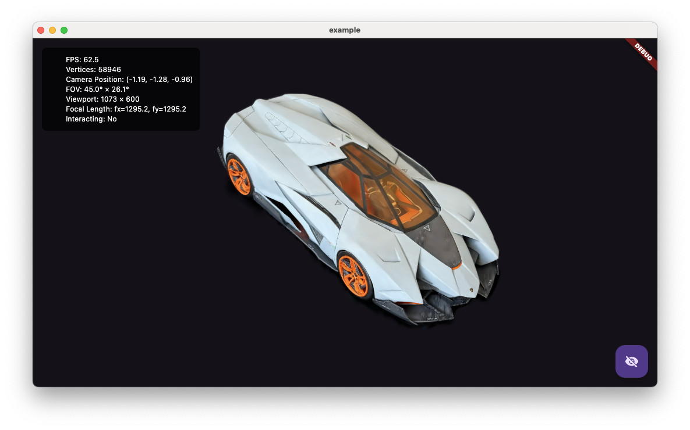

# Flutter Gaussian Splatter

[![Powered by Mason][mason_badge]][mason_link]
[![lints by lintervention][lintervention_badge]][lintervention_link]

---

**🚧 Early Developer Preview 🚧**

This package is an early developer preview and is **not yet intended for production use**.

---

Flutter Gaussian Splatter showcases the use of Gaussian Splatting techniques within the Flutter framework. It leverages the power of [ANGLE (Almost Native Graphics Layer Engine)][angle_link] by Google, via the [flutter_angle][flutter_angle_link] package, to bring high-performance 3D rendering to Flutter applications.

## Overview

This project aims to provide a Flutter widget for rendering 3D scenes using Gaussian Splatting. It's a demonstration of what's possible when combining Flutter's ease of use with low-level graphics capabilities.


## Compatibility

The renderer has been tested on the following devices:
*   Silicon Mac
*   iPhone 13
*   Pixel 4
*   Pixel 5
*   Pixel 7

Due to the low-level nature of the graphics interface, you might encounter issues on other hardware configurations. If you experience any problems, please [open an issue][new_issue_link] on our GitHub repository.

## Known Issues

*   **Memory Leak:** A memory leak may occur when resizing the application window.
*   **Windows Rendering:** There are known rendering problems on the Windows platform.

## Basic Usage Example

To use the `GaussianSplatterWidget`, import the package and add the widget to your Flutter application. You'll need to provide the path to your `.ply` asset.

```dart
import 'package:flutter/material.dart';
import 'package:flutter_gaussian_splatter/widgets/gaussian_splatter_widget.dart';

class MyAwesomeApp extends StatelessWidget {
  const MyAwesomeApp({super.key});

  @override
  Widget build(BuildContext context) {
    return MaterialApp(
      home: Scaffold(
        appBar: AppBar(
          title: const Text('Gaussian Splatter Demo'),
        ),
        body: const GaussianSplatterWidget(
          assetPath: 'assets/your_model.ply', // Replace with your asset path
          // Optional: showStats: true,
        ),
      ),
    );
  }
}
```

Make sure to add your `.ply` file to your `pubspec.yaml` assets:
```yaml
flutter:
  assets:
    - assets/your_model.ply # Or your specific asset path
```

## Call for Contribution

This is an open-source project, and we welcome contributions from the community! Whether it's bug fixes, feature enhancements, or documentation improvements, your help is valuable. Feel free to fork the repository, make your changes, and submit a pull request.

## Installation 💻

**❗ In order to start using Flutter Gaussian Splatter you must have the [Flutter SDK][flutter_install_link] installed on your machine.**

Install via `flutter pub add`:

```sh
flutter pub add flutter_gaussian_splatter
```

## License

This project is licensed under the MIT License - see the [LICENSE](LICENSE) file for details.

---

[mason_link]: https://github.com/felangel/mason
[mason_badge]: https://img.shields.io/endpoint?url=https%3A%2F%2Ftinyurl.com%2Fmason-badge
[lintervention_link]: https://github.com/whynotmake-it/lintervention
[lintervention_badge]: https://img.shields.io/badge/lints_by-lintervention-3A5A40
[flutter_install_link]: https://docs.flutter.dev/get-started/install
[angle_link]: https://github.com/google/angle
[flutter_angle_link]: https://github.com/Knightro63/flutter_angle/tree/main/flutter_angle
[new_issue_link]: https://github.com/toni-experience-software/flutter_gaussian_splatter/issues/new 
[github_actions_link]: https://docs.github.com/en/actions/learn-github-actions